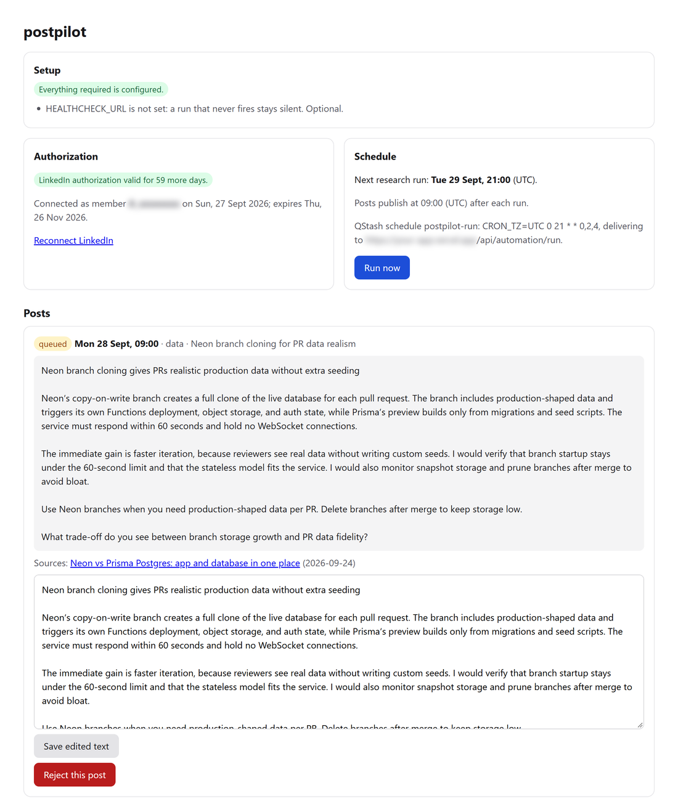
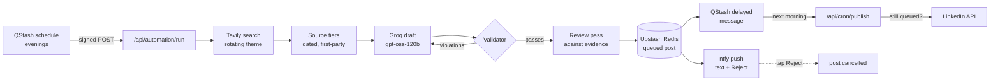
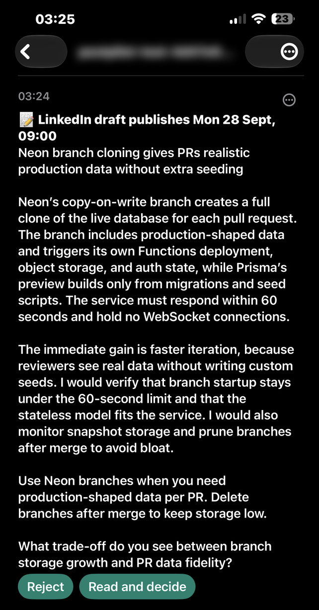
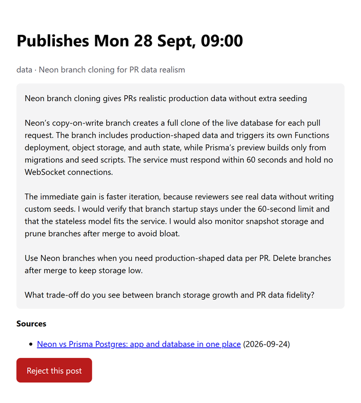

# postpilot

[](https://github.com/ElScelt/postpilot/actions/workflows/ci.yml)

Self-hosted autopilot for your LinkedIn posts. A few evenings a week postpilot researches recent, dated sources on one of your themes, drafts a short post grounded in them, checks it against a strict validator, and sends it to your phone. It publishes the next morning unless you tap **Reject**.

It runs on free tiers: Vercel, Upstash Redis and QStash, Groq, Tavily and ntfy. There are no servers to look after and no third-party posting service between you and LinkedIn.



## How it works



1. A QStash schedule calls `/api/automation/run` on the evenings you configure.
2. The run picks the least recently used theme and searches Tavily for sources from the last two weeks. The search is two queries per pass and up to three passes: trusted domains in the news index, the same domains in the general index, then the open web.
3. Sources are sorted into tiers. A post needs one dated first-party source, or two dated credible publishers reporting the same thing. If a theme has nothing that clears the bar, the next theme is tried.
4. Groq writes a draft as structured JSON. The validator checks it against a fixed set of rules (see [What the validator enforces](#what-the-validator-enforces)). If it fails, the violations and the failed draft are sent back for one corrected attempt.
5. A review pass compares the passing draft with the evidence sentence by sentence, and softens or removes anything the sources don't support.
6. The post is stored in Redis and a delayed QStash message is queued for the publish time. ntfy then sends you the full text with a **Reject** button.
7. At the publish time QStash calls `/api/cron/publish`. If the post is still queued it goes to LinkedIn; if you rejected it, nothing happens.

Every failure, skipped night and expiring authorization reaches you through the same ntfy topic. [docs/ARCHITECTURE.md](docs/ARCHITECTURE.md) walks through the pipeline and folder layout in more detail.

## Features

- **Grounded posts.** Every draft cites dated sources that are stored with the post. Numbers must appear in the evidence, and a review pass removes claims the sources don't support.
- **Review from your phone.** An ntfy push carries the full text, a one-tap Reject and a link to a read-only review page with the sources.
- **A voice that doesn't read like a bot.** The validator bans em-dashes, freshness words, invented personal history, markdown, links and academic citations. It also rejects a hook or closing question that repeats a recent post.
- **Theme rotation.** You define themes and search queries, and the least recently used theme goes first.
- **Typed configuration.** Everything about what gets posted and when lives in `postpilot.config.ts`, which is validated at startup and reports the field that is wrong.
- **Dashboard.** Behind Basic auth: a setup check that names every missing variable, authorization status, next run, recent posts and runs with every rejected draft, plus Run now, Reject and Edit.
- **Operationally boring.** Overlapping runs are locked out, delivery is idempotent, retries use fresh samples, posts that never went out are swept, and a healthchecks.io ping catches a run that never fired.
- **Offline dry run.** `npm run draft -- --offline` runs the whole drafting pipeline on canned data, with no keys and no network.

## Requirements

| Service | Used for | Plan |
| --- | --- | --- |
| [LinkedIn developer app](https://www.linkedin.com/developers/apps) with **Share on LinkedIn** and **Sign In with LinkedIn using OpenID Connect** | Posting (`w_member_social`) and reading your member id (`openid profile`) | Free |
| [Vercel](https://vercel.com/) with Fluid compute | Hosting the Next.js app; a run takes one to two minutes | Hobby (non-commercial) or Pro |
| [Upstash Redis](https://upstash.com/) | OAuth token, posts, run history | Free |
| [Upstash QStash](https://upstash.com/docs/qstash) | Schedule, delayed publishing, signed delivery | Free |
| [Groq](https://console.groq.com/keys) | Drafting with `openai/gpt-oss-120b` | Free |
| [Tavily](https://app.tavily.com/) | Web and news search | Free |
| [ntfy](https://ntfy.sh/) app on your phone | Drafts, the Reject button, alerts | Free |
| [healthchecks.io](https://healthchecks.io/) (optional) | Alerting when a run never fires | Free |

For local development you need Node.js 22.9 or newer; `.nvmrc` pins 22.

## Setup and deploy

1. **Fork or clone this repository** and push it to your own GitHub account. CI runs lint, typecheck, tests, an offline draft and a production dependency audit on every push.
2. **Edit `postpilot.config.ts`.** At minimum set `timeZone`, `persona.role` and your `themes` (see [Configuration](#configuration)). Run `npm ci && npm test` to check that it is valid.
3. **Create the LinkedIn app.** In the [developer portal](https://www.linkedin.com/developers/apps), create an app and, on its Products tab, add both **Share on LinkedIn** and **Sign In with LinkedIn using OpenID Connect**. If either is missing, the consent screen fails with a scope error.
4. **Import the repository into Vercel.** Under Project Settings → Functions, check that **Fluid compute** is enabled (it is the default for new projects). Importing from the dashboard detects Next.js; a project created with `vercel project add` has no framework preset, so set it to Next.js under Project Settings → Build and Deployment or the first deploy fails looking for a `public` directory.
5. **Add Upstash.** From the [Vercel marketplace](https://vercel.com/marketplace/upstash), install the Upstash integration for the project with one Redis database and one QStash instance. This adds `KV_REST_API_URL` and `KV_REST_API_TOKEN` for Redis, and `QSTASH_*`. If the marketplace offers no free Redis database for your account, create one at [console.upstash.com](https://console.upstash.com/) and set `UPSTASH_REDIS_REST_URL` and `UPSTASH_REDIS_REST_TOKEN` yourself.
6. **Set the remaining environment variables** in Vercel (Project → Settings → Environment Variables, Production). `.env.example` lists them all; the [environment variables](#environment-variables) table says where each value comes from.
   - `APP_URL`: `https://YOUR-DOMAIN`, with no path and no trailing slash.
   - `LINKEDIN_REDIRECT_URI`: `https://YOUR-DOMAIN/api/auth/linkedin/callback`.
   - `LINKEDIN_STATE_SECRET`, `AUTOMATION_SECRET`, `NTFY_TOPIC`: three different long random strings, for example from three runs of `openssl rand -hex 32`.

   Vercel reads variables at deploy time, so redeploy after changing any of them. Paste values without a trailing newline or carriage return: a value copied from a file saved with Windows line endings keeps an invisible `
`, and the dashboard password or a signature check then fails.
7. **Register the callback URL.** On the LinkedIn app's Auth tab, add `https://YOUR-DOMAIN/api/auth/linkedin/callback` under Authorized redirect URLs.
8. **Connect LinkedIn.** Open `https://YOUR-DOMAIN/api/auth/linkedin` and approve the consent screen. The callback page shows your member id and when the authorization expires. Set `LINKEDIN_MEMBER_ID` to that id and redeploy, so nobody else can rebind the deployment.
9. **Subscribe to your topic.** Install the ntfy app and subscribe to the `NTFY_TOPIC` value.
10. **Open the dashboard.** Go to `https://YOUR-DOMAIN/dashboard`, enter any username and your `AUTOMATION_SECRET` as the password. The Setup card lists anything still missing. Once it is clean, press **Run now**. That run creates the QStash schedule and drafts a real post for the next publish time. A run takes a minute or two; the ntfy notification arrives when it finishes, and a refresh of the dashboard shows the post.

From then on every run reconciles the live QStash schedule with `postpilot.config.ts`, so a schedule change takes effect after the next run or a **Run now**.

You can also trigger a run without the dashboard:

```bash
curl -X POST https://YOUR-DOMAIN/api/automation/run -H "Authorization: Bearer $AUTOMATION_SECRET"
```

### Trying it locally

```bash
npm ci
npm run draft -- --offline
```

The offline draft runs the real pipeline (theme rotation, source tiers, validator, review) against canned search results and model answers, and prints the decision and the post. To draft from live sources without scheduling, notifying or touching Redis, put `GROQ_API_KEY` and `TAVILY_API_KEY` in `.env.local` and run `npm run draft`, or `npm run draft -- testing` to force a theme.

## Configuration

What gets posted and when is set in `postpilot.config.ts` at the repository root. Every field is optional, and anything you leave out uses the default below. The file is validated on first use: a typo, an unknown key or an impossible value fails the run and the dashboard with a message naming the field. Secrets never go in this file.

```ts
import type { PostpilotConfig } from "./src/lib/config";

const config: PostpilotConfig = {
  timeZone: "Europe/Tallinn",
  publishHour: 9,
  schedule: { days: ["sun", "tue", "thu"], runHour: 21 },
  persona: {
    role: "backend developer who builds payment systems",
    scale: "one engineer on a five-person team running a Go service on managed Postgres",
    stack: ["Go", "Postgres"],
    voice: "Dry, specific, no exclamation marks. Prefers one concrete example over three abstractions.",
  },
  limits: { maxWords: 200 },
  themes: {
    go: {
      label: "Go",
      queries: ["Go release notes new version", "Go team production lessons"],
      brief: "Go language and toolchain changes that affect how a backend service is written or run.",
    },
    postgres: {
      label: "Postgres",
      queries: ["PostgreSQL release performance", "Postgres migration lessons production"],
      brief: "Postgres features, performance and operational changes for an application team.",
    },
  },
};

export default config;
```

| Option | Default | What it does |
| --- | --- | --- |
| `timeZone` | `"UTC"` | IANA time zone for the schedule, the publish hour and every time postpilot shows you, for example `"Europe/Tallinn"`. Daylight saving time is handled. |
| `publishHour` | `9` | Hour (0–23) the post goes out: the first time this hour comes round at least two hours after the run. |
| `schedule.days` | `["sun", "tue", "thu"]` | Days the research run fires: `sun` `mon` `tue` `wed` `thu` `fri` `sat`. |
| `schedule.runHour` | `21` | Hour (0–23) the run fires. The evening before `publishHour` leaves the night to review. |
| `persona.role` | `"working software developer who builds products for a living"` | Who is writing. The prompt opens with "Write an English LinkedIn post as a {role}". |
| `persona.scale` | one developer on a small product team | The scale of decisions the author makes. Anything bigger is framed as someone else's job. |
| `persona.stack` | `[]` | Your stack, for example `["TypeScript", "React"]`. When set, a paragraph opening "For a TypeScript…" is rejected: the stack should show through the decision instead. |
| `persona.avoidTopics` | on-prem, Kubernetes, GPU, data center, tokens per second, … | Terms the post must never use, including plural and suffixed forms. Set `[]` to allow everything. |
| `persona.voice` | `""` | Free-text voice notes passed to the model as "Voice notes from the author". |
| `limits.minWords` / `limits.maxWords` | `140` / `220` | Word range for the post. `minWords` must be below `maxWords`. |
| `limits.maxHookLength` | `160` | Maximum characters in the first paragraph (40 or more). The prompt aims for about three quarters of this. |
| `limits.sourceWindowDays` | `14` | How old a source may be, in calendar days (1–30). Applies to search and validation. |
| `themes` | six web-development themes | Map of theme id (lowercase words joined by hyphens) to `{ label, queries, brief }`. `queries` are natural-language Tavily searches; `brief` tells the model what the theme covers. Setting `themes` replaces the defaults entirely. |

The default themes are Frontend, Backend, AI inside web apps, Testing and CI, Data and storage, and Deploy and platform; their queries are in [src/lib/config/defaults.ts](src/lib/config/defaults.ts). The domains that count as first-party or credible sources are in [src/lib/research/sources.ts](src/lib/research/sources.ts).

### Environment variables

Environment variables hold secrets and infrastructure only.

| Variable | Required | Where it comes from / what happens without it |
| --- | --- | --- |
| `LINKEDIN_CLIENT_ID`, `LINKEDIN_CLIENT_SECRET` | yes | Auth tab of the LinkedIn app. |
| `LINKEDIN_REDIRECT_URI` | yes | `https://YOUR-DOMAIN/api/auth/linkedin/callback`, also registered in the LinkedIn app. |
| `LINKEDIN_STATE_SECRET` | yes | Long random string; signs the OAuth state. |
| `APP_URL` | yes | Your production origin. QStash signatures are verified against it, and every link in notifications uses it. |
| `AUTOMATION_SECRET` | yes | Long random string. It is the dashboard password, the bearer token for manual runs, and the key that signs Reject links. |
| `GROQ_API_KEY`, `TAVILY_API_KEY` | yes | Groq and Tavily consoles. |
| `QSTASH_TOKEN`, `QSTASH_CURRENT_SIGNING_KEY`, `QSTASH_NEXT_SIGNING_KEY` | yes | Added by the Upstash integration. |
| `KV_REST_API_URL`, `KV_REST_API_TOKEN` | yes | Added by the Upstash integration. A database created directly in the Upstash console gives you `UPSTASH_REDIS_REST_URL` and `UPSTASH_REDIS_REST_TOKEN` instead; either pair works. |
| `NTFY_TOPIC` | in practice | Long random topic name. Without it, drafts publish unreviewed and nothing alerts you. |
| `LINKEDIN_MEMBER_ID` | recommended | Pins the deployment to your LinkedIn member. Unset, the first member to connect binds it. |
| `HEALTHCHECK_URL` | no | healthchecks.io ping URL. Without it, a run that never fires is silent. |
| `NTFY_URL`, `NTFY_TOKEN` | no | Self-hosted ntfy server and access token. Default is ntfy.sh, with the topic name as the only secret. |
| `GROQ_MODEL` | no | Defaults to `openai/gpt-oss-120b`. Only gpt-oss models support the strict structured output drafting relies on. |

## Reviewing and rejecting a draft



Each queued draft arrives on your ntfy topic with:

- the full text of the post and the time it will publish;
- a **Reject** button that cancels it in one tap;
- a link to a review page with the text, theme, topic and sources.

**Doing nothing publishes the post.** A rejected post stays in Redis as `cancelled`. Its delayed QStash message still fires, sees that the post is no longer queued, and stops. Reject followed by **Run now** on the dashboard drafts a different story for the same morning.

The review page is read-only on purpose. Anyone who learns the topic name can read and reject drafts, but must never be able to rewrite or publish text under your name. Editing lives on the dashboard, behind `AUTOMATION_SECRET`. Reject links are signed with an HMAC of the post id, so they cannot be guessed for other posts. On iOS the Reject request goes through but the notification stays on screen; open the review page to confirm it took effect.



The same topic also carries:

- a high-priority alert, with the reconnect link, when the LinkedIn authorization is missing, expired, or will expire before the next publish, plus a reminder on every run during its last ten days;
- a low-priority note when a night is skipped, with the reason and the themes tried;
- an alert when a draft fails validation on the last retry, when a run crashes, when a publish fails, and when a post that never went out is retired.

To catch a run that never fires at all (a deleted schedule, rotated keys, a broken deploy), create a [healthchecks.io](https://healthchecks.io/) check whose cron and time zone match your schedule (`0 21 * * 0,2,4` in UTC by default), with a 15-minute grace period. Put its ping URL in `HEALTHCHECK_URL`.

## What the validator enforces

The validator enforces these rules instead of trusting the prompt to follow them. The prompt quotes the same word lists, so the two cannot drift apart.

- `minWords`–`maxWords` words, a hook of at most `maxHookLength` characters, and a specific closing question.
- One dated first-party source, or two dated credible publishers, all reporting the same development and no older than `sourceWindowDays`. Documentation and reference pages carry no date, so they can only accompany a dated source.
- No number of ten or more that the evidence does not state, and no such number spelled out in words.
- No em-dashes, no freshness words ("just", "latest"), no invented personal history ("we migrated", "our codebase"), and no claim about your own systems stated as fact ("our component library renders").
- Complete sentences: every prose paragraph ends with a full stop, no two sentences run together, and no run-together compounds ("adhoc", "a trade off"). Checklist lines are exempt.
- No links, e-mail addresses, markdown, citation placeholders or academic citations.
- No paragraph that announces the stack, and no term from `persona.avoidTopics`.
- A hook and closing question that don't start like a recent post's, and a theme that differs from the previous post's.

## Limitations

- **LinkedIn authorization expires and cannot be refreshed.** LinkedIn issues no refresh token for `w_member_social` to ordinary apps. The access token lasts about 60 days, after which you open `/api/auth/linkedin` again. postpilot warns you on ntfy for ten days beforehand, and again if the token will expire before the next publish.
- **Text posts only.** There are no images, documents or polls.
- **No comment replies.** Reading comments needs the `r_member_social` scope, which LinkedIn doesn't grant to individual apps.
- **Free-tier limits apply.**
  - Tavily's free plan has a monthly credit allowance. A typical run makes a few advanced searches, but a night where no theme has evidence can try every theme.
  - Groq's free tier limits tokens per minute. An oversized request is retried once with shorter excerpts.
  - QStash's free plan limits how far ahead a message can be delayed (seven days at the time of writing) and keeps logs for three days.

  Check each provider's current limits.
- **Vercel Hobby is for non-commercial use.** If your posts promote paid work, use Vercel Pro or another host.
- **One author per deployment.** The Redis keys and QStash schedule are global to the deployment.
- **LinkedIn API versions sunset.** Calls try each entry of `linkedInApiVersions` in [src/lib/linkedin/api.ts](src/lib/linkedin/api.ts) in turn, and move on when a version answers 426. Add the newest version at the front every few months.

### Storage keys

postpilot keeps everything in Redis under the `postpilot:` prefix: `postpilot:token`, `postpilot:posts`, `postpilot:runs` and a short-lived `postpilot:run-lock:<date>`. The QStash schedule id is `postpilot-run`. Give each deployment its own Redis database and QStash instance.

## FAQ

**Is automated posting allowed by LinkedIn?**
postpilot posts through LinkedIn's official API, as you, with the Share on LinkedIn product LinkedIn offers for that purpose, and every post waits for your review window. You are still responsible for what you publish and for following LinkedIn's terms.

**Why does nothing get posted some nights?**
No theme had sources that cleared the bar, or the model judged the evidence not worth a post. The ntfy note and the dashboard's run history name each theme's reason and the hosts it returned. If it keeps happening, broaden your theme queries.

**Can I edit a draft instead of rejecting it?**
Yes. Open the dashboard: every queued post has a text box. The original text is kept alongside your edit.

**Can I change which websites count as trustworthy sources?**
Yes, in [src/lib/research/sources.ts](src/lib/research/sources.ts). It is code rather than configuration because the tiers interact with the validator.

**Can I use a model other than gpt-oss-120b?**
Only the gpt-oss models on Groq support the strict JSON schema output drafting relies on. `GROQ_MODEL` accepts any of them.

**Why does a schedule change not show up in QStash immediately?**
The schedule is reconciled at the start of every run. Deploy the change, then press **Run now** or wait for the next run.

**How do I post in a language other than English?**
The prompt and validator word lists are English, so you would have to change `src/lib/drafting/prompt.ts` and `src/lib/drafting/rules.ts`.

**Where do I see why a draft was rejected by the validator?**
On the dashboard's run history: every rejected draft is listed next to the rule it tripped. Locally, `npm run draft` prints the same.

## Operations

| Symptom | What happened | What to do |
| --- | --- | --- |
| "LinkedIn posting is stopped" or "Reconnect LinkedIn tonight" | The authorization is missing or expiring. | Open `/api/auth/linkedin` and approve again. |
| "No LinkedIn post tonight" | No theme had evidence that cleared the bar. | Nothing. If it repeats, read the run record and broaden the queries. |
| "The draft failed validation" | Both drafts broke a rule on the last retry. | Read the rejected drafts on the dashboard; iterate with `npm run draft`. |
| "LinkedIn publish failed" | The publish request was rejected. | Reconnect if the message mentions authorization. A 426 on every version means `linkedInApiVersions` needs a newer entry. |
| "A LinkedIn post never went out" | Every delivery attempt failed and the sweep retired the post. | Check LinkedIn before posting the text by hand. |
| The dashboard rejects the right password | The `AUTOMATION_SECRET` value was saved with a trailing `
` or newline. | Set the variable again without it and redeploy. |
| Silence on a run night | The run never fired, or ntfy is down. | healthchecks.io pages you if configured. Otherwise check the QStash console and the Vercel function logs. |

## Contributing and security

See [CONTRIBUTING.md](CONTRIBUTING.md) for development setup, and [SECURITY.md](SECURITY.md) for reporting vulnerabilities. Never commit secrets: `.env*` files are ignored, apart from `.env.example`, which holds placeholders only.

## License

[MIT](LICENSE) © 2026 Edgar Raudsepp
