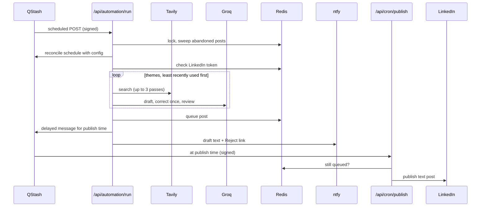

# Architecture

postpilot is a Next.js App Router app with no UI beyond a dashboard and a review page. The work happens in four route handlers, each started by QStash, LinkedIn or you. All state lives in one Upstash Redis database. There is no background worker: every step is a signed HTTP request with a time budget.

## The pipeline



### 1. Run (`src/app/api/automation/run/route.ts` → `src/lib/automation.ts`)

`runAutomation` is the orchestrator. Its dependencies are injected, so tests replace every service with a fake. In order, it:

1. **Takes a lock** keyed by the publish date, so a manual run and a scheduled firing can't both queue a post for the same morning. The lock expires after the route's `maxDuration`, so a run the platform kills never blocks QStash's retries, and only the run holding its token can release it.
2. **Sweeps** posts still queued hours after their slot, marks them failed and alerts you. A post a killed delivery left `publishing` may be on LinkedIn, so it is marked failed with an alert to check LinkedIn and is never retried.
3. **Reconciles** the QStash schedule with the one computed from `postpilot.config.ts`. A failure here only adds a warning.
4. **Checks the LinkedIn token.**
   - A missing or expired token stops the run with a high-priority alert.
   - If the token expires before the publish time, the draft still queues but you get an alert.
   - In the token's last ten days you get a reminder.
5. **Skips** if an automated post is already queued or posted for that day.
6. **Drafts** with `generateGroundedDraft` (below), then stores the post, queues the delayed QStash publish message, and sends the ntfy notice.
7. **Records** the run (status, themes tried, evidence hosts, rejected drafts, warnings). The route then pings the healthcheck.

A draft that fails validation twice answers 500, so QStash retries with a fresh sample. A skip for lack of evidence answers 200 and stays skipped. A delivery that finds another run for the same morning holding the lock answers 503 without recording anything or pinging the heartbeat, so QStash comes back later and finds the post queued or the lock free; only the last retry alerts.

### 2. Research (`src/lib/research/`)

- `themes.ts` reads the themes from config and orders them least recently used first, breaking ties by the calendar.
- `tavily.ts` runs each theme's queries in up to three passes and stops as soon as the merged results clear the bar:
  1. evidence domains in the news index;
  2. the same domains in the general index;
  3. the open web.
- `sources.ts` sorts each result into a tier:
  - **primary:** the vendor's own announcement;
  - **credible:** an established publisher;
  - **reference:** undated documentation;
  - **unrated:** everything else, including forums, gists and account, sign-in or status portals under a vendor domain.

  `meetsEvidenceBar` requires one dated primary source or two dated credible ones. `focusEvidence` passes the model only the sources it may draw on.

### 3. Drafting (`src/lib/drafting/`)

- `prompt.ts` builds the generation prompt from the persona, the hard rules (which quote `rules.ts` word lists) and the evidence. It also defines the strict JSON schema the model must answer in.
- `groq.ts` is the only code that talks to Groq. It handles retries, rate limits, and a smaller retry when a request is too large for the free tier.
- `decision.ts` parses and normalises the model's JSON, matches cited URLs to the evidence and attaches the source metadata. When strict JSON mode refuses an answer only because its paragraphs are nested objects, `repairDraftJson` unwraps it; for anything else, `draftJsonProblem` words a correction that names what was wrong.
- `rules.ts` is the validator. `draftViolations` returns every violation at once, so the correction prompt can list them all.
- `review.ts` asks the model to check the passing draft sentence by sentence against the evidence. The reviewed draft must pass the validator again; otherwise the validated draft ships with a note. The review also removes a cited source that reports a different story; if the remaining sources cannot clear the evidence bar, the theme counts as declined.
- `pipeline.ts` ties these together. It tries themes in order, gives each draft one correction, and drafts at most three themes per run. Its deadline is the run route's `maxDuration` less the time needed to queue the post and send the notification: once a theme has been drafted, no further theme starts without 75 seconds left (the first theme with evidence is always drafted, since a retry would only repeat the same searches), every Tavily and Groq request is cut off at the deadline, and a Groq rate-limit wait that would pass it fails the run instead, so the run records the failure and QStash retries it.

### 4. Review and publish

- `src/lib/notify/ntfy.ts` sends the draft with a signed Reject link (`src/lib/security/reject-token.ts`).
- `src/lib/storage/posts.ts` keeps every post in one JSON array under `postpilot:posts`. Every write reads the array, changes it and commits it with a compare-and-set script, and starts over if another writer got there first, so concurrent writers never undo each other. The array is checked against `postSchema` on every read. It is loose, so fields an older or newer version wrote survive a write, and a post it cannot read stops the read before anything is written. The run history (`runs.ts`) and the token (`linkedin/token.ts`) are checked the same way, except that a run record this version cannot read is left out of the list but kept in the store.
- `src/app/api/posts/reject/` shows the read-only review page (GET) and cancels the post (POST). A GET never cancels, so link prefetching can't kill a post.
- `src/app/api/cron/publish/` receives the delayed QStash message. It claims the post (`queued` → `publishing`) before calling LinkedIn through `src/lib/linkedin/publish.ts`, so a Reject or an edit that arrives mid-call is refused rather than silently lost. If a version answers 426, the next LinkedIn API version is tried. What happens next depends on whether LinkedIn can have the post:
  - **accepted:** the post is marked `posted`. The route answers 2xx even if that write fails twice, so a retry can never post twice; the alert then names the LinkedIn post id.
  - **refused** (no token, any 4xx, 502 or 503): the post goes back to `queued` and the route answers 502, so QStash retries.
  - **unknown** (a timeout after 20 seconds, a broken connection, 500, 504 or another 5xx): the post is marked `failed`, you are told to check LinkedIn, and it is never retried.

  A delivery that finds the post already `publishing` answers 503 while the earlier delivery may still be running, and retires it as unknown once it cannot be.

## Folder layout

```text
postpilot.config.ts          what gets posted and when (validated by src/lib/config)
scripts/
  draft.ts                   npm run draft: one draft locally, no Redis, no notifications
  offline.ts                 canned Tavily and Groq answers for --offline
  check-data.ts              npm run check:data: can this version read a deployment's Redis?
  stored-data.ts             the check itself, tested without Redis
src/
  proxy.ts                   Basic auth in front of /dashboard
  app/
    page.tsx, layout.tsx     landing page
    dashboard/               setup check, status, posts, runs; Run now, Reject, Edit
    api/
      automation/run/        the nightly run (QStash-signed or bearer AUTOMATION_SECRET)
      cron/publish/          delayed publish of one post (QStash-signed)
      posts/reject/          review page and Reject (HMAC-signed link)
      auth/linkedin/         OAuth start and callback
  lib/
    automation.ts            the run orchestrator
    setup-check.ts           the dashboard's Setup card
    env.ts, errors.ts        required() / appUrl(), errorMessage()
    config/                  schema, defaults and loader for postpilot.config.ts
    research/                themes, Tavily search, source tiers
    drafting/                prompt, Groq client, decision parsing, validator, review, pipeline
    linkedin/                API client, token storage, OAuth state
    scheduling/              QStash client, schedule and publish-time maths, time zones
    storage/                 Redis client, posts, run history
    notify/                  ntfy and healthchecks.io
    security/                QStash/bearer auth, dashboard auth, reject tokens, constant-time compare
test/                        node:test suites, one per module, all services faked
docs/                        this file and README images
```

## Conventions

- **Config vs environment.** `postpilot.config.ts` holds behaviour, and environment variables hold secrets and infrastructure. Functions that depend on config take the relevant slice as a defaulted parameter (`settings = config()`), so tests pass their own.
- **Injected services.** Network and storage are default parameters too (`fetcher = fetch`, `client = redis()`). Tests never touch the network.
- **Time zones.** Local-to-UTC conversion goes through `Intl.DateTimeFormat` in `scheduling/time.ts`, which handles daylight saving time. QStash crons carry `CRON_TZ`.
- **Named resources** all start with `postpilot`: Redis keys (`postpilot:*`), the QStash schedule id and message labels, and the OAuth state cookie.
